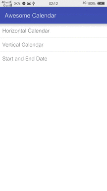

# awesome-calendar
The awesome calendar for Android.



This awesome calendar is designed to meet more complex business requirements for Android development.
And it's easy to make a custom perfect ui. This calender is more flexible to adapt different ui and
the complicated logic.

For those who wants to see the details, you can find the latest build in Google Play Store.

<a href="https://play.google.com/store/apps/details?id=net.gongmingqm10.calendar" alt="Download from Google Play">
  
</a>

## Different Calendars
Below is the different type of the CalendarViews. One CalendarView can response your click event. Logic
can be handled here. While the following different forms CalendarView is just use the CalendarView in the
container like ViewPager and ListView. Feel free to use it in any different containers. All you need to do
is parse one display date for this CalendarView.

### Horizontal Calendar
The horizontal calendar is build with ViewPager whose child item is one CalendarCard. Use can swipe it
horizontally. And then choose one date of it.

### Vertical Calendar
The vertical calendar is build with ListView whose child item is CalendarCard with some information text.
What you need to do is to `setAdapter` for the ListView.

### Start and Return Date
This is the most important part of the awesome calendar. User can select one start date and one end date.
All the logic can be adapted in the `onClickListener`. It's easy to understand and use if you see the code.

## Custom the UI
If you have a better design for the calender, you'll find it's easy to change to another style. It's more
convenient than System Calendar ui kit.

## License
```
The MIT License (MIT)

Copyright (c) 2015 gongmingqm10

Permission is hereby granted, free of charge, to any person obtaining a copy
of this software and associated documentation files (the "Software"), to deal
in the Software without restriction, including without limitation the rights
to use, copy, modify, merge, publish, distribute, sublicense, and/or sell
copies of the Software, and to permit persons to whom the Software is
furnished to do so, subject to the following conditions:

The above copyright notice and this permission notice shall be included in all
copies or substantial portions of the Software.

THE SOFTWARE IS PROVIDED "AS IS", WITHOUT WARRANTY OF ANY KIND, EXPRESS OR
IMPLIED, INCLUDING BUT NOT LIMITED TO THE WARRANTIES OF MERCHANTABILITY,
FITNESS FOR A PARTICULAR PURPOSE AND NONINFRINGEMENT. IN NO EVENT SHALL THE
AUTHORS OR COPYRIGHT HOLDERS BE LIABLE FOR ANY CLAIM, DAMAGES OR OTHER
LIABILITY, WHETHER IN AN ACTION OF CONTRACT, TORT OR OTHERWISE, ARISING FROM,
OUT OF OR IN CONNECTION WITH THE SOFTWARE OR THE USE OR OTHER DEALINGS IN THE
SOFTWARE.
```
